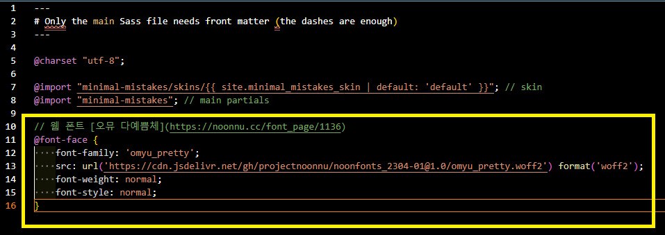
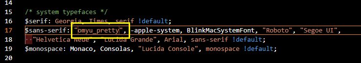

## 웹 폰트 적용하기

### 조건

- minimal mistakes theme 를 적용한 jekyll 환경.

#### 1. 웹 폰트 고르기

- 사이트에서 마음에 드는 웹폰트 코드를 복사한다.
  - [눈누 : https://noonnu.cc/](https://noonnu.cc/)

#### 2. 웹폰트 코드 추가

- 파일 경로 : assets/css/main.scss

#### 3. 폰트명 추가

 - 파일 경로 : _sass/minimal-mistakes/_variables.scss

